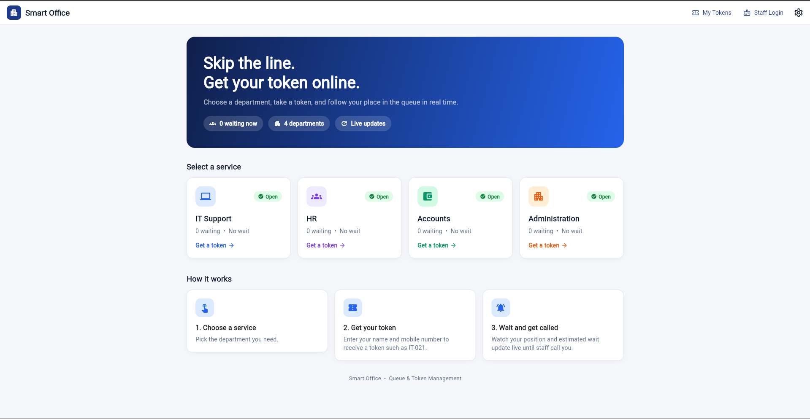

# Smart Office Queue & Token Management System

A web-based queue and token management system that allows visitors to select an office department, generate a token online, track their queue position, and get called by staff.

## 🖥️ Home Page

## 🎬 Demo Video

[▶️ Watch the full project demo on Google Drive](https://drive.google.com/file/d/1Ikq_sIZUcE8Rdu5-ahu-2Jz85Crbkwfk/view?usp=sharing)

## ✨ Features

### 👤 Visitor
- Choose a department
- Generate a backend-created token such as `IT-001`
- View queue position and people ahead
- View estimated waiting time
- Track live queue updates
- Cancel a waiting token

### 👨‍💼 Staff
- Secure staff login
- View department queue
- Call the next token
- Complete a service
- Mark a token as no-show
- Transfer tokens to another department
- Set token priority
- Pause and resume a department
- View queue and dashboard information

### 🛡️ Admin
- Manage and monitor all departments
- Access staff-level queue operations across departments
- View dashboard statistics

## 🏢 Departments

The system includes four departments:

- IT Support
- HR
- Accounts
- Administration

## 🔄 How It Works

Visitor → Select Department → Generate Token → Track Queue → Staff Calls Token → Service → Complete / No-show / Transfer

## 🧰 Technology Stack

| Layer | Technology |
|---|---|
| Frontend | Flutter Web |
| State Management | Riverpod 2 |
| Backend | Go 1.22+ |
| API | REST / JSON |
| Database | PostgreSQL 14+ |
| Authentication | JWT + bcrypt |
| HTTP | Go `net/http` |
| Database Driver | `database/sql` + `lib/pq` |

## 🏗️ Architecture

Flutter Web → REST / JSON → Go Backend → SQL / Transactions → PostgreSQL

The backend manages token generation, priority, no-show handling, transfers, pause/resume, and concurrency. PostgreSQL is the source of truth.

## 📌 Queue Rules

- Token numbers are generated per department and reset daily.
- Priority re-orders waiting tokens but does not interrupt a token already being served.
- First no-show returns the token to the end of the queue.
- Second no-show cancels the token.
- Tokens can be transferred between departments.
- Pausing a department blocks new tokens.
- `Call next` uses database locking to prevent duplicate token assignment.
- A staff member cannot call another token while still serving one.
- A mobile number cannot hold two active tokens in the same department.
- Queue position and estimated waiting time are calculated from live queue data.

## 🚀 Project Setup

### Prerequisites

- Go 1.22+
- PostgreSQL 14+
- Flutter SDK 3.19+
- Google Chrome

### Database

    cd database
    setup.bat

Manual database setup:

    psql -U postgres -c "CREATE DATABASE smart_office"
    psql -U postgres -d smart_office -f database/schema.sql
    psql -U postgres -d smart_office -f database/seed.sql

### Backend

    cd backend
    copy .env.example .env
    go mod tidy
    go run ./cmd/server

Backend URL:

    http://localhost:8080

Health check:

    http://localhost:8080/api/health

### Frontend

    cd frontend
    powershell -ExecutionPolicy Bypass -File .\setup_web.ps1
    flutter run -d chrome --web-port 3000

Frontend URL:

    http://localhost:3000

## 🔐 Default Demo Logins

| Role | Email | Password |
|---|---|---|
| Admin | `admin@smartoffice.com` | `Admin@123` |
| IT Staff | `it.staff@smartoffice.com` | `Staff@123` |
| HR Staff | `hr.staff@smartoffice.com` | `Staff@123` |
| Accounts Staff | `accounts.staff@smartoffice.com` | `Staff@123` |
| Administration Staff | `admin.staff@smartoffice.com` | `Staff@123` |

> These are demo credentials. Change them before real deployment.

## 📡 Main API

### Public APIs

| Method | Endpoint |
|---|---|
| GET | `/api/health` |
| POST | `/api/auth/login` |
| GET | `/api/departments` |
| GET | `/api/departments/:id` |
| POST | `/api/visitors` |
| POST | `/api/tokens` |
| GET | `/api/tokens/:id` |
| PATCH | `/api/tokens/:id/cancel` |
| GET | `/api/tokens/:id/queue-position` |

### Staff / Admin APIs

| Method | Endpoint |
|---|---|
| GET | `/api/auth/me` |
| GET | `/api/dashboard` |
| GET | `/api/queues/:departmentId` |
| POST | `/api/queues/:departmentId/call-next` |
| POST | `/api/tokens/:id/complete` |
| POST | `/api/tokens/:id/no-show` |
| POST | `/api/tokens/:id/transfer` |
| POST | `/api/tokens/:id/priority` |
| PATCH | `/api/departments/:id/pause` |
| PATCH | `/api/departments/:id/resume` |

## 📁 Project Structure

    smart-office-queue-token-management/
    │
    ├── README.md
    ├── docs/
    │   └── home-page.png
    │
    ├── database/
    │   ├── schema.sql
    │   ├── seed.sql
    │   ├── setup.bat
    │   └── setup.sh
    │
    ├── backend/
    │   ├── cmd/
    │   │   ├── server/
    │   │   ├── hashpw/
    │   │   └── smoketest/
    │   ├── config/
    │   ├── database/
    │   ├── models/
    │   ├── repositories/
    │   ├── services/
    │   ├── handlers/
    │   ├── middleware/
    │   ├── routes/
    │   └── utils/
    │
    └── frontend/
        ├── lib/
        │   ├── config/
        │   ├── models/
        │   ├── services/
        │   ├── providers/
        │   ├── utils/
        │   ├── widgets/
        │   └── screens/
        ├── test/
        └── pubspec.yaml

## 🧪 Testing

Backend smoke test:

    cd backend
    go run ./cmd/smoketest

Frontend tests:

    cd frontend
    flutter test

The project includes testing for department queues, token generation, queue position, cancellation, priority, no-show handling, transfer, pause/resume, dashboard updates, staff permissions, and concurrent `Call next` operations.

## 🎯 Project Objective

The Smart Office Queue & Token Management System is designed to reduce physical waiting lines and provide a structured digital queue for office departments.

It helps visitors:

- Get tokens online
- Avoid unnecessary physical queues
- Track their position
- View estimated waiting time
- Receive service efficiently

It helps staff and administrators:

- Manage department queues
- Call tokens
- Track service status
- Handle no-shows
- Transfer tokens
- Monitor queue statistics

---

**Smart Office • Queue & Token Management**

Built with Flutter, Go and PostgreSQL.

